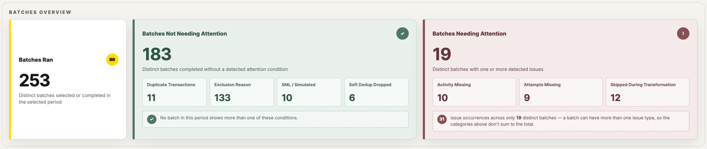
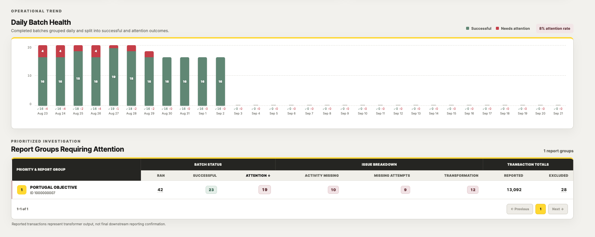

### Dashboard Analysis

> **Reproducing the captured SQL in this folder**: the queries below were captured from the
> `TracingNamedParameterJdbcTemplate` debug log (the backend's persistence layer migrated from jOOQ
> to hand-written SQL over Spring JDBC; this wrapper replaced the old `PrettySqlExecuteListener`).
> That logging defaults to `OFF`, because its output includes fetched rows — party names, dates of
> birth, phone numbers, ID numbers — and on a deployed host that becomes a second copy of customer
> PII outside the database's access controls. Run with `SQL_LOG_LEVEL=DEBUG` locally when you need
> to capture queries again. Per-query timings remain available at all times via
> `QueryPerformanceSummaryLogger`, which logs no row data.
> The same concern applies one layer up: nginx's access log defaults to logging the full request
> line, query string included, and several endpoints' query strings carry an identifier or MTCN —
> see `TransactionReport.md`'s "On-demand detail" section for the fix there.

## 1. View



### Query

```sql
select
  ("rtr_aggregates"."batches_ran" + "not_yet_reported"."batches_not_yet_reported") as "batchesRan",
  "not_yet_reported"."batches_not_yet_reported" as "batchesNotYetReported",
  "rtr_aggregates"."batches_needing_attention" as "batchesNeedingAttention",
  "rtr_aggregates"."transformation_failure_batches" as "transformationFailureBatches",
  "rtr_aggregates"."missing_attempt_batches" as "missingAttemptBatches",
  "rtr_aggregates"."activity_missing_batches" as "activityMissingBatches",
  "rtr_aggregates"."duplicate_transaction_batches" as "duplicateTransactionBatches",
  "rtr_aggregates"."exclusion_batches" as "exclusionBatches",
  "rtr_aggregates"."simulated_transaction_batches" as "simulatedTransactionBatches",
  "rtr_aggregates"."soft_dedup_batches" as "softDedupBatches"
from (
  select
    count(distinct ("rtr_scope"."rpt_grp_id", "rtr_scope"."batch_id", "rtr_scope"."seq_no")) filter (where true) as "batches_ran",
    count(distinct ("rtr_scope"."rpt_grp_id", "rtr_scope"."batch_id", "rtr_scope"."seq_no")) filter (where (
      coalesce("rtr_scope"."activity_transformation_failed", 0) > 0
      or coalesce("rtr_scope"."txn_missing_attempt_count", 0) > 0
      or coalesce("rtr_scope"."activity_missing", 0) > 0
    )) as "batches_needing_attention",
    count(distinct ("rtr_scope"."rpt_grp_id", "rtr_scope"."batch_id", "rtr_scope"."seq_no")) filter (where coalesce("rtr_scope"."activity_transformation_failed", 0) > 0) as "transformation_failure_batches",
    count(distinct ("rtr_scope"."rpt_grp_id", "rtr_scope"."batch_id", "rtr_scope"."seq_no")) filter (where coalesce("rtr_scope"."txn_missing_attempt_count", 0) > 0) as "missing_attempt_batches",
    count(distinct ("rtr_scope"."rpt_grp_id", "rtr_scope"."batch_id", "rtr_scope"."seq_no")) filter (where coalesce("rtr_scope"."activity_missing", 0) > 0) as "activity_missing_batches",
    count(distinct ("rtr_scope"."rpt_grp_id", "rtr_scope"."batch_id", "rtr_scope"."seq_no")) filter (where (
      coalesce("rtr_scope"."duplicate_transformation", 0) > 0
      and coalesce("rtr_scope"."activity_transformation_failed", 0) = 0
      and coalesce("rtr_scope"."txn_missing_attempt_count", 0) = 0
      and coalesce("rtr_scope"."activity_missing", 0) = 0
    )) as "duplicate_transaction_batches",
    count(distinct ("rtr_scope"."rpt_grp_id", "rtr_scope"."batch_id", "rtr_scope"."seq_no")) filter (where (
      coalesce("rtr_scope"."excluded_txn", 0) > 0
      and coalesce("rtr_scope"."activity_transformation_failed", 0) = 0
      and coalesce("rtr_scope"."txn_missing_attempt_count", 0) = 0
      and coalesce("rtr_scope"."activity_missing", 0) = 0
    )) as "exclusion_batches",
    count(distinct ("rtr_scope"."rpt_grp_id", "rtr_scope"."batch_id", "rtr_scope"."seq_no")) filter (where (
      coalesce("rtr_scope"."txn_simulated", 0) > 0
      and coalesce("rtr_scope"."activity_transformation_failed", 0) = 0
      and coalesce("rtr_scope"."txn_missing_attempt_count", 0) = 0
      and coalesce("rtr_scope"."activity_missing", 0) = 0
    )) as "simulated_transaction_batches",
    count(distinct ("rtr_scope"."rpt_grp_id", "rtr_scope"."batch_id", "rtr_scope"."seq_no")) filter (where (
      coalesce("rtr_scope"."soft_dedup_dropped_txn_count", 0) > 0
      and coalesce("rtr_scope"."activity_transformation_failed", 0) = 0
      and coalesce("rtr_scope"."txn_missing_attempt_count", 0) = 0
      and coalesce("rtr_scope"."activity_missing", 0) = 0
    )) as "soft_dedup_batches"
  from (
    select "pharos"."report_transformation_reconciliation".*
    from "pharos"."report_transformation_reconciliation"
    where (
      "pharos"."report_transformation_reconciliation"."created_timestamp" >= timestamp '2026-08-01 00:00:00.0'
      and "pharos"."report_transformation_reconciliation"."created_timestamp" < timestamp '2026-09-22 00:00:00.0'
      and "pharos"."report_transformation_reconciliation"."rpt_grp_id" in (1000000007, 9002)
    )
  ) as "rtr_scope"
) as "rtr_aggregates"
cross join (
  select count(distinct ("pharos"."record_transformation_journey"."rpt_grp_id", "pharos"."record_transformation_journey"."batch_id")) filter (where true) as "batches_not_yet_reported"
  from "pharos"."record_transformation_journey"
  where (
    "pharos"."record_transformation_journey"."created_timestamp" >= timestamp '2026-08-01 00:00:00.0'
    and "pharos"."record_transformation_journey"."created_timestamp" < timestamp '2026-09-22 00:00:00.0'
    and "pharos"."record_transformation_journey"."rpt_grp_id" in (1000000007, 9002)
    and not exists (
      select 1
      from "pharos"."report_transformation_reconciliation"
      where "pharos"."report_transformation_reconciliation"."rpt_grp_id" = "pharos"."record_transformation_journey"."rpt_grp_id"
      and "pharos"."report_transformation_reconciliation"."batch_id" = "pharos"."record_transformation_journey"."batch_id"
    )
  )
) as "not_yet_reported"
```

*Captured live from the `PrettySqlExecuteListener` debug log for `country=PT`; `rpt_grp_id in (...)` reflects that country's report groups and shifts per request. Previously also computed `totalReportedTransactions`/`totalExcludedTransactions` — removed because no frontend component read them off this response's top level (see [home.component.ts](../frontend/src/app/home.component.ts)); the same two totals remain available per-period and per-report-group via the trend and report-groups queries below, which the UI does read.*

### Plain English

This is the query behind the row of KPI numbers at the top of the Batch View page (Batches Ran,
Successful, Needing Attention, Transformation Failures, etc.). In plain terms:

1. Look at every batch that finished reconciliation in the selected date range, for the countries
   the user picked.
2. For each batch, check a handful of yes/no questions: did any transformation fail? Were any
   transaction attempts missing? Was any expected activity never found? If the answer to any of
   those is "yes," the batch counts as **Needing Attention**.
3. Count how many batches fall into each specific problem bucket (failures, missing attempts,
   activity missing, duplicates, exclusions, simulated transactions, soft-dedup drops) — a batch
   can land in more than one bucket if it has more than one kind of problem.
4. Separately (the `cross join` part), count batches that show up in the day-to-day processing
   log (`record_transformation_journey`) but have **no row yet** in the reconciliation table —
   these are batches still in flight that haven't posted final numbers, shown as "Batches Not Yet
   Reported" so they don't silently disappear from the count.

The net effect: one number for "how many batches ran," a breakdown of "how many had each kind of
issue," and a separate heads-up for "how many are still being worked on."

### Code Flow

- **API**: `GET /dashboardDetails/batch-view` — `DashboardApi.getBatchDashboard` (`com.pharos.compliance.dashboard.api.DashboardApi`)
- **Controller**: `DashboardController` (`com.pharos.compliance.dashboard.controller.DashboardController`)
- **Service**: `DashboardServiceImpl.getBatchDashboard` (`com.pharos.compliance.dashboard.service.impl.DashboardServiceImpl`)
- **Repository**: `DashboardRepository.getDashboardCounts` (`com.pharos.compliance.dashboard.repository.DashboardRepository`)

## 2. View



### Query — Daily Batch Health (trend chart)

```sql
select
  "periods"."period_start" as "periodStart",
  coalesce("period_metrics"."batches_ran", 0) as "batchesRan",
  (coalesce("period_metrics"."batches_ran", 0) - coalesce("period_metrics"."batches_needing_attention", 0)) as "successfulBatches",
  coalesce("period_metrics"."batches_needing_attention", 0) as "batchesNeedingAttention"
from (
  select generate_series(date '2026-08-01', date '2026-09-21', '7 days'::interval) as "period_start"
) as "periods"
left outer join (
  select
    date '2026-08-01' + ((("pharos"."report_transformation_reconciliation"."created_timestamp"::date - date '2026-08-01') / 7) * 7) as "period_start",
    count(distinct ("pharos"."report_transformation_reconciliation"."rpt_grp_id", "pharos"."report_transformation_reconciliation"."batch_id", "pharos"."report_transformation_reconciliation"."seq_no")) filter (where true) as "batches_ran",
    count(distinct ("pharos"."report_transformation_reconciliation"."rpt_grp_id", "pharos"."report_transformation_reconciliation"."batch_id", "pharos"."report_transformation_reconciliation"."seq_no")) filter (where (
      coalesce("pharos"."report_transformation_reconciliation"."activity_transformation_failed", 0) > 0
      or coalesce("pharos"."report_transformation_reconciliation"."txn_missing_attempt_count", 0) > 0
      or coalesce("pharos"."report_transformation_reconciliation"."activity_missing", 0) > 0
    )) as "batches_needing_attention"
  from "pharos"."report_transformation_reconciliation"
  where (
    "pharos"."report_transformation_reconciliation"."created_timestamp" >= timestamp '2026-08-01 00:00:00.0'
    and "pharos"."report_transformation_reconciliation"."created_timestamp" < timestamp '2026-09-22 00:00:00.0'
    and "pharos"."report_transformation_reconciliation"."rpt_grp_id" in (1000000007, 9002)
  )
  group by date '2026-08-01' + ((("pharos"."report_transformation_reconciliation"."created_timestamp"::date - date '2026-08-01') / 7) * 7)
) as "period_metrics"
  using ("period_start")
order by "periods"."period_start"
```

*One row per bucket in the date range (bucket width — day/week/month — is chosen by `TrendGranularity.forPeriod`, WEEKLY for this ~7-week range), left-joined from a `generate_series` calendar so empty buckets still appear as zero rather than being silently dropped. Neither this nor `transformationFailureBatches`/`missingAttemptBatches`/`activityMissingBatches` (removed earlier) nor `totalReportedTransactions`/`totalExcludedTransactions` (removed here) are computed anymore — the transaction totals now live in their own dedicated query for Transactions Overview's trend chart (see below), which is a different query, not just a different response shape: this page's request and that page's request never both need this table scanned with the same filters in the same request, so splitting the query itself costs neither page an extra round trip while sparing each one's request from aggregating columns it will never read.*

### Plain English

This powers the "Daily/Weekly Batch Health" trend chart. It first builds an evenly-spaced calendar
of buckets across the selected date range (one per day, week, or month depending on how wide the
range is), then for each bucket counts how many batches ran and how many of those needed attention
— the exact same "needing attention" definition as the KPI cards above, just sliced by time instead
of totalled into one number. The calendar join is what makes a week with zero batches show up as a
flat "0" bar instead of a gap in the chart, since a plain `group by` on the data alone would simply
omit weeks with nothing in them.

### Code Flow — Daily Batch Health

- **API**: `GET /dashboardDetails/batch-view` — `DashboardApi.getBatchDashboard` (`com.pharos.compliance.dashboard.api.DashboardApi`)
- **Controller**: `DashboardController` (`com.pharos.compliance.dashboard.controller.DashboardController`)
- **Service**: `DashboardServiceImpl.getBatchDashboard` → `toBatchHealthTrendResponse` (`com.pharos.compliance.dashboard.service.impl.DashboardServiceImpl`)
- **Repository**: `DashboardRepository.getBatchHealthTrend` (`com.pharos.compliance.dashboard.repository.DashboardRepository`)
- **DTO**: `BatchHealthTrendResponse` (`com.pharos.compliance.dashboard.dto.BatchHealthTrendResponse`)

### Query — Transactions Overview trend (heatmap/line charts)

```sql
select
  "periods"."period_start" as "periodStart",
  coalesce("period_metrics"."total_reported_transactions", 0) as "totalReportedTransactions",
  coalesce("period_metrics"."total_excluded_transactions", 0) as "totalExcludedTransactions"
from (
  select generate_series(date '2026-08-01', date '2026-09-21', '7 days'::interval) as "period_start"
) as "periods"
left outer join (
  select
    date '2026-08-01' + ((("pharos"."report_transformation_reconciliation"."created_timestamp"::date - date '2026-08-01') / 7) * 7) as "period_start",
    coalesce(sum("pharos"."report_transformation_reconciliation"."actual_reportable_txn"), 0) as "total_reported_transactions",
    coalesce(sum("pharos"."report_transformation_reconciliation"."excluded_txn"), 0) as "total_excluded_transactions"
  from "pharos"."report_transformation_reconciliation"
  where (
    "pharos"."report_transformation_reconciliation"."created_timestamp" >= timestamp '2026-08-01 00:00:00.0'
    and "pharos"."report_transformation_reconciliation"."created_timestamp" < timestamp '2026-09-22 00:00:00.0'
    and "pharos"."report_transformation_reconciliation"."rpt_grp_id" in (1000000007, 9002)
  )
  group by date '2026-08-01' + ((("pharos"."report_transformation_reconciliation"."created_timestamp"::date - date '2026-08-01') / 7) * 7)
) as "period_metrics"
  using ("period_start")
order by "periods"."period_start"
```

*Not part of Batch View — belongs to `/dashboardDetails/transaction-view`, included here only to show what used to be one shared query is now two. Same calendar-bucketing scaffolding as the query above (factored into a shared `buildTrendPeriods` helper in the repository, since that part is identical for both), different aggregate.*

### Plain English

Same calendar-bucket idea as the batch health trend above, but instead of counting batches it adds
up two transaction totals per bucket, straight from each batch's own reconciliation numbers:
"how many transactions did this batch actually report" and "how many did it exclude." This is the
simple, add-up-the-batch-totals version of Reported/Excluded — not the same definition as the
"ever reported"/"ever excluded" per-transaction rollup used by the Transactions Overview KPI cards
themselves (see `TransactionOverview.md`), which is why the two can show different numbers for a
seemingly similar question. This one exists purely to draw the trend line/heatmap over time.

**Code Flow — Transactions Overview trend**: `TransactionDashboardResponse` ← `DashboardServiceImpl.getTransactionDashboard` → `toTransactionVolumeTrendResponse` ← `DashboardRepository.getTransactionVolumeTrend` → `TransactionVolumeTrendResponse` DTO.

### Query — Report Groups Requiring Attention (table)

```sql
select
  "report_group_metrics"."rpt_grp_id" as "reportGroupId",
  "report_group_metrics"."rpt_grp_name" as "reportGroupName",
  "report_group_metrics"."batches_ran" as "batchesRan",
  ("report_group_metrics"."batches_ran" - "report_group_metrics"."batches_needing_attention") as "successfulBatches",
  "report_group_metrics"."batches_needing_attention" as "batchesNeedingAttention",
  "report_group_metrics"."transformation_failure_batches" as "transformationFailureBatches",
  "report_group_metrics"."missing_attempt_batches" as "missingAttemptBatches",
  "report_group_metrics"."activity_missing_batches" as "activityMissingBatches",
  "report_group_metrics"."total_reported_transactions" as "totalReportedTransactions",
  "report_group_metrics"."total_excluded_transactions" as "totalExcludedTransactions"
from (
  select
    "pharos"."report_transformation_reconciliation"."rpt_grp_id",
    max("pharos"."report_transformation_reconciliation"."rpt_grp_name") as "rpt_grp_name",
    count(distinct ("pharos"."report_transformation_reconciliation"."batch_id", "pharos"."report_transformation_reconciliation"."seq_no")) filter (where true) as "batches_ran",
    count(distinct ("pharos"."report_transformation_reconciliation"."batch_id", "pharos"."report_transformation_reconciliation"."seq_no")) filter (where (
      coalesce("pharos"."report_transformation_reconciliation"."activity_transformation_failed", 0) > 0
      or coalesce("pharos"."report_transformation_reconciliation"."txn_missing_attempt_count", 0) > 0
      or coalesce("pharos"."report_transformation_reconciliation"."activity_missing", 0) > 0
    )) as "batches_needing_attention",
    count(distinct ("pharos"."report_transformation_reconciliation"."batch_id", "pharos"."report_transformation_reconciliation"."seq_no")) filter (where coalesce("pharos"."report_transformation_reconciliation"."activity_transformation_failed", 0) > 0) as "transformation_failure_batches",
    count(distinct ("pharos"."report_transformation_reconciliation"."batch_id", "pharos"."report_transformation_reconciliation"."seq_no")) filter (where coalesce("pharos"."report_transformation_reconciliation"."txn_missing_attempt_count", 0) > 0) as "missing_attempt_batches",
    count(distinct ("pharos"."report_transformation_reconciliation"."batch_id", "pharos"."report_transformation_reconciliation"."seq_no")) filter (where coalesce("pharos"."report_transformation_reconciliation"."activity_missing", 0) > 0) as "activity_missing_batches",
    coalesce(sum("pharos"."report_transformation_reconciliation"."actual_reportable_txn"), 0) as "total_reported_transactions",
    coalesce(sum("pharos"."report_transformation_reconciliation"."excluded_txn"), 0) as "total_excluded_transactions"
  from "pharos"."report_transformation_reconciliation"
  where (
    "pharos"."report_transformation_reconciliation"."created_timestamp" >= timestamp '2026-08-01 00:00:00.0'
    and "pharos"."report_transformation_reconciliation"."created_timestamp" < timestamp '2026-09-22 00:00:00.0'
    and "pharos"."report_transformation_reconciliation"."rpt_grp_id" in (1000000007, 9002)
  )
  group by "pharos"."report_transformation_reconciliation"."rpt_grp_id"
) as "report_group_metrics"
where true
order by
  "report_group_metrics"."batches_needing_attention" desc,
  ("report_group_metrics"."transformation_failure_batches" + "report_group_metrics"."missing_attempt_batches" + "report_group_metrics"."activity_missing_batches") desc,
  "report_group_metrics"."rpt_grp_id"
```

*One row per report group in scope; when scope is already narrowed to one country or one report group, the `where true` drops the "only groups with an issue" filter so the caller sees full health, not just problems (see `attentionScope` in the repository method).*

### Plain English

This is the same "count batches, flag the ones with issues" logic as the top KPI cards, but this
time it doesn't collapse everything into one number — it groups by report group first (e.g. one
row for "FRANCE OBJECTIVE," one for "GERMANY STR"), so the table can show which specific report
groups have batches needing attention, how many of each problem type they have, and their total
reported/excluded transaction counts. It's the "which of my report groups are on fire" view, where
the KPI cards above are the "is anything on fire at all" view.

### Code Flow — Report Groups Requiring Attention

- **API**: `GET /dashboardDetails/batch-view` — `DashboardApi.getBatchDashboard` (`com.pharos.compliance.dashboard.api.DashboardApi`)
- **Controller**: `DashboardController` (`com.pharos.compliance.dashboard.controller.DashboardController`)
- **Service**: `DashboardServiceImpl.getBatchDashboard` → `toReportGroupResponse` (`com.pharos.compliance.dashboard.service.impl.DashboardServiceImpl`)
- **Repository**: `DashboardRepository.getReportGroupsRequiringAttention` (`com.pharos.compliance.dashboard.repository.DashboardRepository`)

